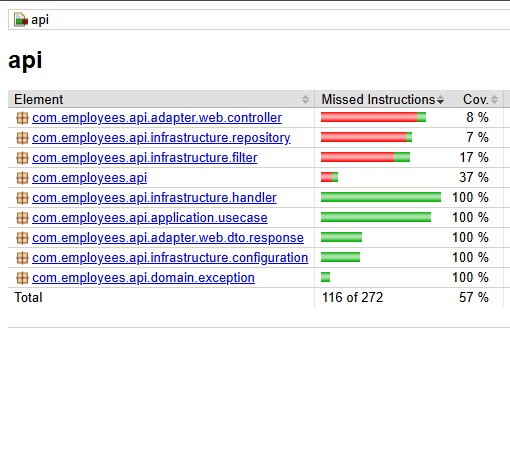
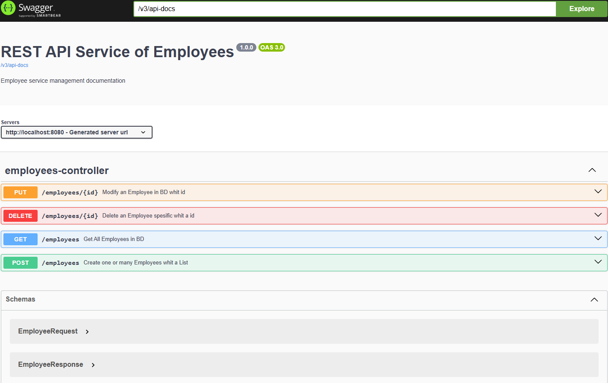
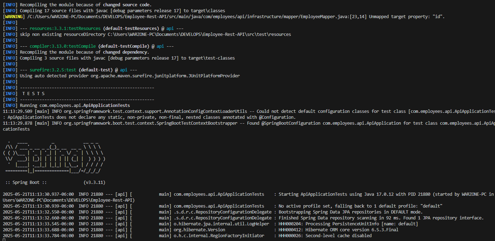
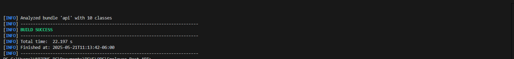
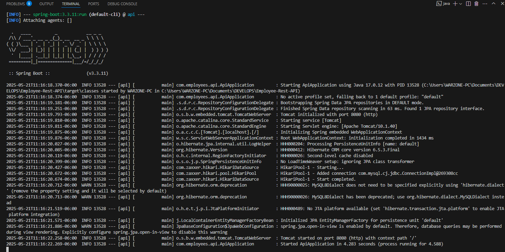
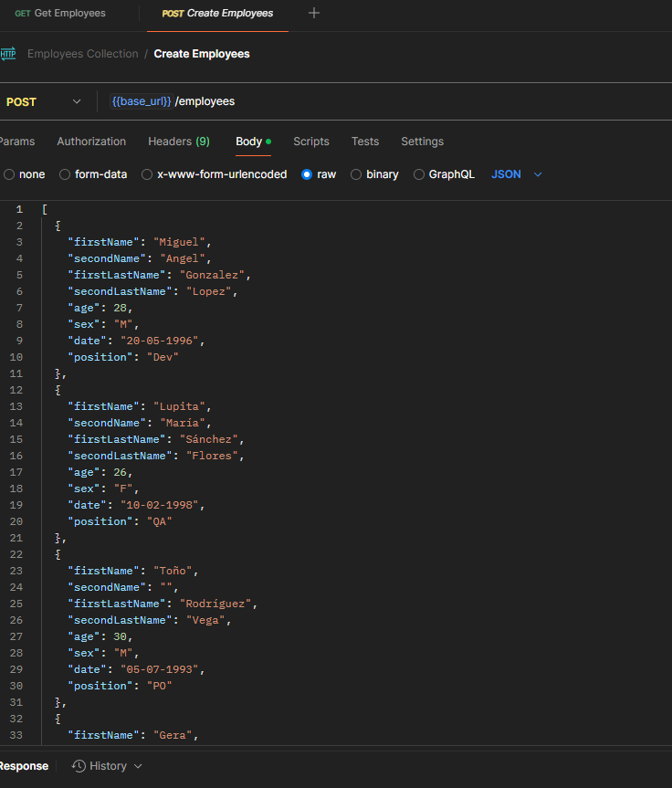
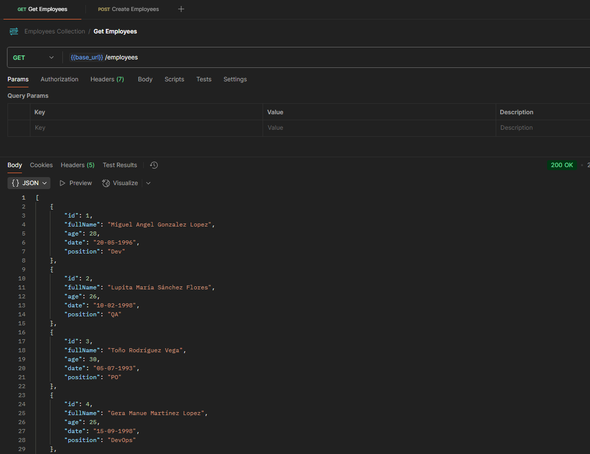
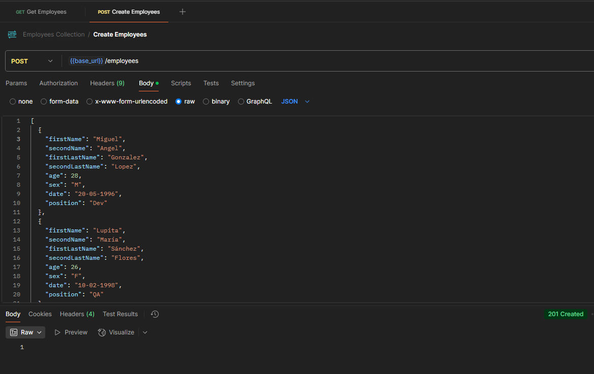
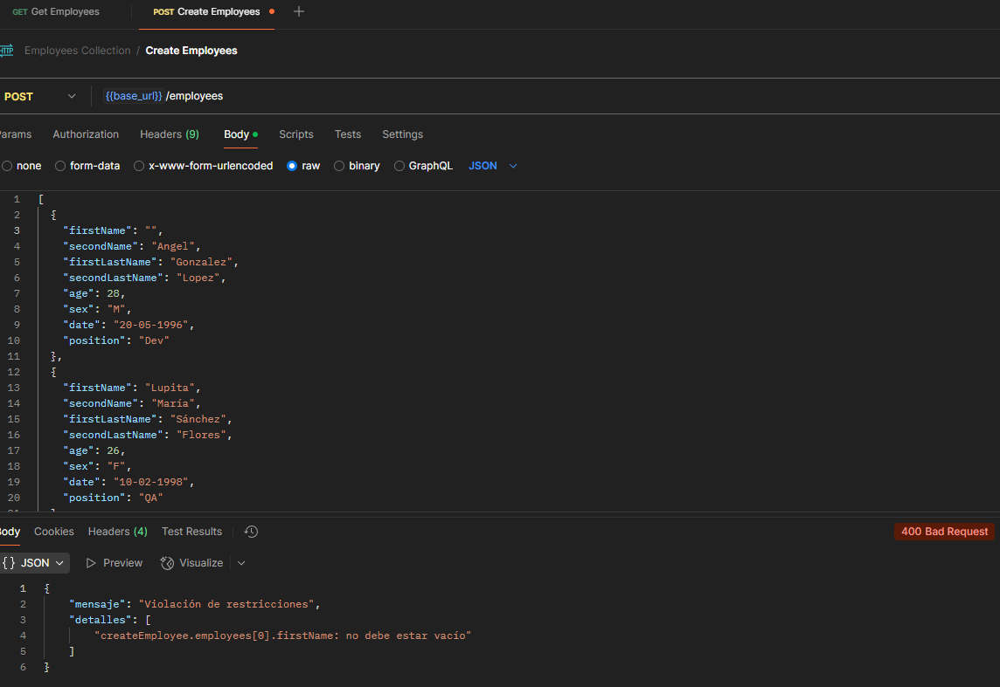

# Employee Management REST API

API REST en Java 17 con Spring Boot 3.3.x para la gestión de empleados, implementada con los principios de **Clean Architecture**

---
## Descripción

Esta API permite realizar operaciones CRUD sobre el recurso `Empleado`. El sistema está diseñado de manera modular, manteniendo la lógica de negocio separada de frameworks y adaptadores (Spring, JPA).

---

## Tecnologías utilizadas

| Tecnología     | Versión     |
|----------------|-------------|
| Java           | 17          |
| Spring Boot    | 3.3.11      |
| Hibernate|      ✓    |
| JPA|      ✓    |
| Maven          | 3.9.x       |
| MapStruct      | 1.5+        |
| Lombok         | ✓           |
| JUnit / Mockito| ✓           |
| Swagger/OpenAPI| ✓           |
| MySQL          | 8+          |

---

## Arquitectura
El proyecto está organizado siguiendo **Clean Architecture**, lo que permite:

- Independencia del framework (Spring, JPA)
-  Testeable
- Fácil mantenimiento y escalabilidad
- Separación clara entre capas

## Estructura con Clean Architecture

El proyecto está organizado de esta manera con **Clean Architecture**:
src/  
├── domain/ → Modelo de dominio puro (sin dependencias)  
├── application/ → Casos de uso y puertos  
├── adapter/web/ → Controladores REST y DTOs  
├── infrastructure/ → JPA, mapeos, filtros y configuración

## Manejo de excepciones

- Manejadas globalmente usando `@ControllerAdvice` con un`GlobalExceptionHandler`.
- Se devuelve un objeto de error estructurado y uniforme para cualquier excepción controlada
- Excepciones personalizadas: por ejemplo `EmpleadoNotFoundException`, usada cuando no se encuentra un ID.
- Errores de validación de campos (`@Valid`) mapeados a respuestas claras por campo.

---
## DTOs + MapStruct

- Uso de `EmployeeRequest` y `EmployeeResponse` para desacoplar la API del modelo de dominio.
- MapStruct convierte automáticamente entre DTO ↔ Dominio ↔ Entidad.
- Conversión de fechas manejada con formato explícito: `dd-MM-yyyy`.
- Limpieza de código: sin necesidad de setters manuales ni lógica de transformación repetida.
---
### Testabilidad y mantenibilidad
El archivo de Coverage se encuentra aqui:
🧪[jacoco Report](target/site/jacoco/index.html)


- La lógica de negocio (`EmployeeServiceImpl`) es independiente de Spring, facilitando pruebas unitarias puras.
- Los mappers y validaciones pueden probarse por separado.
- Dependencias inyectadas por constructor (buenas prácticas de inversión de dependencias).

---
## Documentación Swagger

Se integró Swagger/OpenAPI para visualizar y probar todos los endpoints REST de forma interactiva.



### Acceso a la documentación

Una vez levantado el proyecto, puedes acceder a Swagger UI en:

`{server o localhost}/swagger-ui/index.html`

---
## Base de Datos

Esta API utiliza una base de datos MySQL llamada `employees_test`. A continuación se detalla la estructura de la tabla `employees`, la cual contiene la información de los empleados gestionados por el sistema.

### Tabla: `employees`

| Columna           | Tipo           | Nulo permitido |  Comentario                |
|-------------------|----------------|----------------|---------------------------|
| `id`              | `bigint`       | NO             |Llave primaria            |
| `age`             | `int`          | NO             |Edad del empleado         |
| `date`            | `date`         | NO             |Fecha de nacimiento|
| `first_last_name` | `varchar` | NO             |Primer apellido           |
| `first_name`      | `varchar` | NO             | Primer nombre             |
| `position`        | `varchar` | NO             | Puesto del empleado       |
| `second_last_name`| `varchar` | NO             | Segundo apellido          |
| `second_name`     | `varchar` | SÍ             | Segundo nombre (opcional) |
| `sex`             | `varchar` | NO             | Sexo del empleado         |


### Script SQL de la base de datos
El Script de la BD se encuentra en la raíz del repositorio, aun así JPA está configurado para crear la tabla automáticamente si no existe siempre y cuando la BD esté creada y conectada

🧾[Script SQL](employees_test.sql)

---

## Instalación y Ejecución

```bash
# Clona el repositorio
git clone https://github.com/miguel-gl/Employee-Rest-API.git

# Construye el proyecto
mvn clean install
```


```bash
# Ejecuta la aplicación
mvn spring-boot:run
```

---
## Endpoints

| Método | Endpoint | Descripción |
|--|--|--|
| GET  | `/api/employees` |Listar todos los empleados |
| POST | `/api/employees` | Crear uno o varios empleados |
| PUT | `/api/employees/{id}` | Actualizar los datos de un empleado |
| DELETE | `/api/employees/{id}` | Eliminar un empleado por su ID |
---


## Modelo de datos `Employee`

```json
[
	{
		"firstName":  "Miguel",
		"secondName":  "Angel",
		"firstLastName":  "Gonzalez",
		"secondLastName":  "Lopez",
		"age":  33,
		"sex":  "M",
		"date":  "20-05-1992",
		"position":  "Dev"
	}
]
```

# Postman
La coleccion de postman 	ue se uso para realizar pruebas funcionales esta dentro del repoaitorio:
📚[Colección de Postman](src\test\java\com\employees\api\postman\Employees-Collection.postman_collection.json)

---
## Datos de prueba
Dentro de la coleccion de Postman está la petición `POST`, lista con datos para insertar empleados de prueba


---
 
## Respuestas HTTP 

-  `ResponseEntity` usado para controlar el status code exacto en cada respuesta.
- Códigos utilizados:
-  `200 OK` para lecturas
	
-  `201 Created` para inserciones
	
-  `400 Bad Request` para errores de validación
	
-  `404 Not Found` para recursos inexistentes
	
- Las respuestas de error mantienen un formato uniforme.
---

## Autor
Desarrollado por **Miguel Ángel González López**
Contacto: [mgonzalez0492@gmail.com](mgonzalez0492@gmail.com)